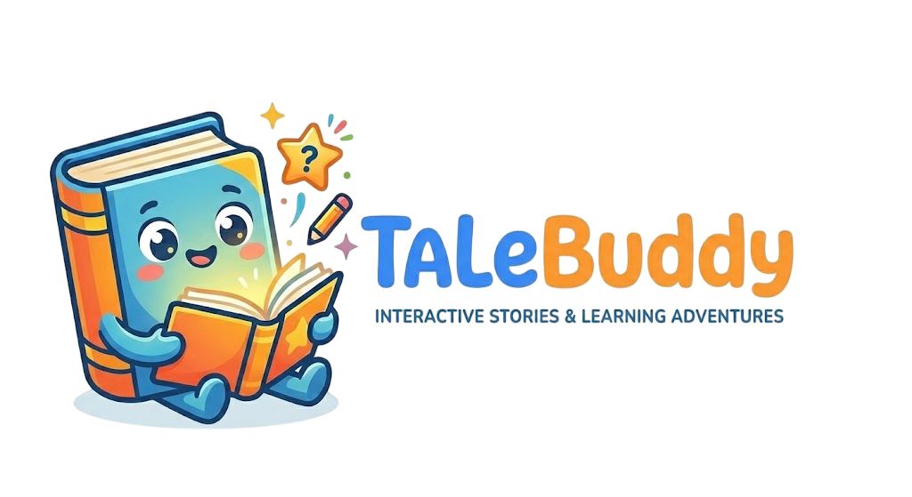

<div align="center">

# TaleBduddy
### *Deeply Personalized Interactive Edutainment for Every Child*

[](https://kitahack.com)
[](https://sdgs.un.org/goals/goal4)
[](https://sdgs.un.org/goals/goal10)
[](https://cloud.google.com/vertex-ai)

> **AI-Native Edutainment** — Kids & Parents co-create deeply personalized interactive learning experiences, powered by Google Gemini and Veo.

</div>

---

## 🌍 The Problem We Solve

Traditional textbooks and static learning materials leave millions of children behind — especially those with **learning disabilities**. Rigid, one-size-fits-all content:

- Fails to capture and sustain attention for neurodivergent learners
- Offers no personalization to a child's unique character, interests, or pace
- Creates frustration, anxiety, and widening educational gaps
- Limits access to quality education for children who don't thrive in conventional settings

**This directly undermines:**
- **SDG 4** (Quality Education): inclusive and equitable quality education for all
- **SDG 10** (Reduced Inequalities): leveling the educational playing field for neurodivergent children

---

## ✨ Our Solution

**TaleBuddyk** transforms studying into a **cinematic, interactive adventure**. Parents and children together:
1. **Create a custom character** with a unique name
2. **Choose a topic** they want to learn (e.g., Photosynthesis, Fractions, The Solar System)
3. **Select a story style** that excites them (Fantasy, Space Adventure, Jungle Explorer...)
4. **Watch their character star in an AI-generated educational cartoon** with interactive quiz checkpoints built in

Every episode is **uniquely generated** — no two episodes are ever the same. The child's own character guides them through the learning journey, creating deep emotional engagement.

---

## 🤖 AI & Google Technology Stack

| Technology | Role |
|---|---|
| **Vertex AI — Gemini 3.0 Pro** | Episode planning, scene expansion, schema validation & repair. Uses `HIGH` thinking mode for interactive quiz scenes and `LOW` thinking for narrative scenes. |
| **Vertex AI — Veo 3.1** | Generates high-quality 3D animated cartoon videos (8 seconds per scene, 16:9, with synchronized audio/dialogue) — one per scene, totaling 8 videos per episode. |
| **Google Cloud Storage (GCS)** | Stores all generated videos. Signed URLs are issued per episode for secure, time-limited frontend access. |
| **Google Cloud Run** | Hosts the stateless backend API in a scalable, serverless container. Zero cold-start management needed. |

### How AI Makes It Smarter

Without AI, this platform would be a **static video player**. With AI:

- **Gemini 3.0 Pro** designs the entire 8-scene learning arc from a single topic prompt, crafts age-appropriate dialogue, writes detailed Veo video generation prompts, creates pedagogically sound MCQ quiz questions, and auto-repairs any structural errors in its own output.
- **Veo 3.1** generates a unique animated video for each scene — referencing the child's custom character image for visual consistency across all 8 scenes using asset-reference mode.
- Together, they make every single episode **fully unique, personalized, and impossible to replicate** without generative AI.

---

## 🏗️ Architecture


### Generation Pipeline

The backend uses a **3-phase pipeline**:

| Phase | Description |
|---|---|
| **Phase A** — Episode Plan | Gemini generates a complete 8-scene episode JSON (structure, dialogue, quiz questions) with `HIGH` thinking mode |
| **Phase B** — Scene Expansion | Each scene is expanded with a detailed Veo prompt. Interactive scenes (2, 4, 6) use `HIGH` thinking; narrative scenes (1, 3, 5, 7, 8) use `LOW` thinking for efficiency |
| **Phase C** — Video Generation | Veo 3.0 generates one 8-second video per scene sequentially. Each call polls until the operation completes, then stores the signed URL |

Validation runs between Phase B and C, with up to **3 auto-repair attempts** via Gemini if the schema is invalid.

### Episode Structure

Each episode always contains exactly **8 scenes**:

| Scene | Type | Purpose |
|---|---|---|
| 1 | 📖 Narrative | Introduce the main concept |
| 2 | ❓ **Interactive Quiz** | First comprehension check |
| 3 | 📖 Narrative | Deepen understanding |
| 4 | ❓ **Interactive Quiz** | Apply concept to new situation |
| 5 | 📖 Narrative | Expand the concept |
| 6 | ❓ **Interactive Quiz** | Synthesis / real-world application |
| 7 | 📖 Narrative | Connect to real-world context |
| 8 | 📖 Narrative | Celebrate & recap learning |

---

## 📁 Project Structure

```
Kitahack/
├── backend/                        # Python FastAPI backend
│   ├── main.py                     # API server: /generate-episode, /episodes/{id}
│   ├── create_episode_engine.py    # Core AI pipeline (Gemini + Veo orchestration)
│   ├── pyproject.toml              # Python dependencies (uv)
│   ├── Dockerfile                  # Container definition for Cloud Run
│   ├── .env.template               # Environment variable template
│   └── .env                        # (local only, git-ignored)
│
└── frontend/                       # Next.js 16 frontend
    ├── app/
    │   └── page.tsx                # Root page entry
    ├── components/
    │   ├── App.tsx                 # Main app state machine (routing between views)
    │   ├── LandingPage.tsx         # Welcome screen with CTA
    │   ├── CharacterSelection.tsx  # Character builder (name, image upload, topic, style)
    │   ├── StoryBook.tsx           # Main episode viewer (video + scene navigation)
    │   ├── NarrativePanel.tsx      # Displays dialogue for non-interactive scenes
    │   └── QuizCard.tsx            # MCQ quiz with sound, feedback & animations
    ├── assets/                     # Static assets (logo, sounds)
    └── public/                     # Next.js public folder
```

---

## 🚀 Getting Started

### Prerequisites

- **Node.js** 18+ and `npm`
- **Python** 3.10+
- **[uv](https://docs.astral.sh/uv/)** (Python package manager)
- A **Google Cloud Project** with the following APIs enabled:
  - Vertex AI API
  - Cloud Storage API
  - Cloud Run API (for deployment)

### 1. Clone the repository

```bash
git clone https://github.com/<your-org>/kitahack.git
cd kitahack
```

### 2. Backend Setup

```bash
cd backend

# Copy and fill in environment variables
cp .env.template .env
# Edit .env with your Google Cloud project details

# Install dependencies with uv
uv sync

# Run the development server
uv run uvicorn main:app --reload --port 8000
```

**Backend `.env` variables:**

| Variable | Description |
|---|---|
| `GOOGLE_CLOUD_PROJECT` | Your GCP project ID |
| `GOOGLE_CLOUD_LOCATION` | Vertex AI region (default: `us-central1`) |
| `GOOGLE_APPLICATION_CREDENTIALS` | Path to your service account JSON key |
| `VEO_BUCKET` | GCS bucket name for storing generated videos |
| `VEO_MODEL` | Veo model to use (default: `veo-3.0-generate-preview`) |

### 3. Frontend Setup

```bash
cd frontend

# Install dependencies
npm install

# Set the backend URL
echo "NEXT_PUBLIC_API_URL=http://localhost:8000" > .env.local

# Run the development server
npm run dev
```

Open [http://localhost:3000](http://localhost:3000) in your browser.

---


## 🎨 Frontend Components

| Component | Description |
|---|---|
| `LandingPage` | Animated glassmorphism welcome screen with a "Get Started" CTA |
| `CharacterSelection` | Multi-step form: topic input, story style picker, character name & image upload |
| `StoryBook` | Main episode player — streams scenes sequentially, handles video playback and transitions |
| `NarrativePanel` | Displays the character's spoken dialogue for non-interactive (story) scenes |
| `QuizCard` | Animated MCQ card with 4 options, correct/incorrect sound effects, and visual feedback |

---

## 🌱 SDG Impact

| Goal | How We Contribute |
|---|---|
| **SDG 4 — Quality Education** | Deliver inclusive, engaging, and high-quality learning content personalized to each child's needs |
| **SDG 10 — Reduced Inequalities** | Bridge the educational gap for neurodivergent children (ADHD, autism) who are left behind by traditional methods |

---

## 🔭 Future Roadmap

- **Voice interaction** — Children speak answers aloud; Gemini listens and responds
- **Multi-language support** — Episodes generated in Bahasa Malaysia, Mandarin, Tamil, and more
- **Progress tracking** — Firebase Firestore to track skills learned and quiz performance over time
- **Offline mode** — Pre-download episodes for areas with limited connectivity
- **School dashboard** — Teacher/parent portal to monitor engagement and learning outcomes
- **Expanded character library** — Pre-built animated characters, not just uploaded images

---

## 👥 Team

Built for **KitaHack 2026** — addressing SDG 4 (Quality Education) and SDG 10 (Reduced Inequalities).

---

<div align="center">

*"Every child deserves a learning experience that speaks to them."*

</div>
