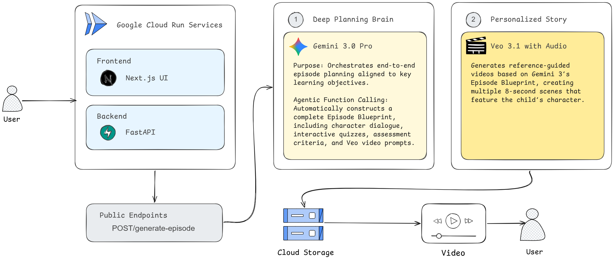

# TaleBuddy
TaleBuddy generates personalized, animated educational episodes for young learners. A user selects an animal character and enters a topic (e.g., "photosynthesis" or "fractions"). The system then:
- Uses Gemini (LLM) to write an 8-scene episode plan with narrative scenes and multiple-choice quiz scenes.
- Uses Veo (video generation model) to render a short animated clip for each scene, with audio dialogue.
- Stores the videos in Google Cloud Storage and returns signed URLs to the frontend.
- Presents the episode as a paginated "storybook" where narrative scenes play video with dialogue, and interactive scenes present a quiz that must be answered before the episode advances.

# Repository Structure
|Directory|Technology|Role|
|-|-|-|
|`backend/`|Python 3, FastAPI	HTTP API|episode generation orchestration, GCS storage|
|`frontend/`|Next.js, React, TypeScript, Tailwind CSS|Browser UI, episode polling, video playback|

The two primary backend files are:

|File|Role|
|-|-|
|backend/main.py|FastAPI app, HTTP endpoints, in-memory state, background tasks|
|backend/create_episode_engine.py|Gemini + Veo + GCS orchestration pipeline|

The frontend's state is centralized in a single component:

|File|Role|
|-|-|
|frontend/components/App.tsx|Sole state owner, top-level route controller|
|frontend/components/LandingPage.tsx|Entry screen|
|frontend/components/CharacterSelection.tsx|Character picker + episode creation|
|frontend/components/StoryBook.tsx|Episode polling, buffering, and playback|
|frontend/components/QuizCard.tsx|Interactive MCQ scenes|
|frontend/components/NarrativePanel.tsx|Non-interactive dialogue scenes|

# System Architecture

